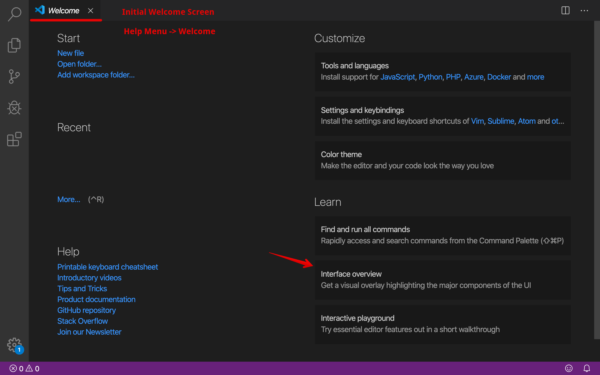

 

VSCode Visual Studio Code 
=====================

- VSCode Visual Studio Code for Faster Web Development
- VSCode Visual Studio Code for Beginners
- VSCode Visual Studio Code Basics
- VSCode Visual Studio Code Essentials

Description
---------------------

Let us learn the essentials of the VSCode Visual Studio Code. This course/tutorial will help to learn important features, tips and tricks widely used and pretty useful for day-to-day faster web development.

Topics (separate with spaces)
---------------------

Add topics to categorize your repository and make it more discoverable:

- vscode
- vscode-extension
- vscode-theme
- vscode-snippets
- vs-code
- visual-studio-code
- visual-studio-code-extension
- visual-studio-code-theme
- vs-code-shortcuts
- visual-studio-code-shortcuts
- vscode-web-development
- vscode-visual-studio-beginners
- vscode-visual-studio-basics
- vscode-visual-studio-essentials
- vscode-emmet
- vscode-multicursor
- vscode-prettier
- vscode-debugger
- vscode-tips-tricks
- vscode-command-palette-navigation

Welcome
---------------------

Hi All, I'm **`Dinanath Jayaswal, Senior UI/Web Developer and Adobe Certified Expert Professional`**, I wanna welcome you to the `VSCode Visual Studio Code for Faster Web Development`.

About the Course/Tutorial
---------------------

VSCode Visual Studio Code is one of the most powerful **IDE (Integrated Development Environment)** developed and maintained by `Microsoft Corporation`. It works extremely well with almost all programming languages like C# (C-Sharp), Java, Python, JavaScript and so on. VSCode Visual Studio Code is loaded with various rich features and functionalities.

Let us learn the essentials of the VSCode Visual Studio Code. This course/tutorial will help to learn important features, tips and tricks widely used and pretty useful for day-to-day faster web development.

This tutorial explains the fundamental/essential concepts to make the best use of the VSCode Visual Studio Code to work faster. Here will go through and learn some important capabilities of the VSCode Visual Studio Code.

What will learn and cover
---------------------

Welcome to the new tutorial series on VSCode Visual Studio Code. 

In this introductory VSCode Visual Studio Code module will have a look and learn:
- What is Visual Studio Code?
- Features of Visual Studio Code
- Why do we need a Visual Studio Code?
- How to install the Visual Studio Code?
- Basic Operations in Visual Studio Code
- Command-Line, Command Palette Navigation
- File Encoding Support in Visual Studio Code
- Shortcuts in Visual Studio Code
- Customization in Visual Studio Code with Themes and Icon Themes

Who is this for? Audience
---------------------

This Course/Tutorial is ideal for: 
- Freshers
- Intermediates
- Beginner Programmers
- Any Developer/Designer
- Web Designers and Developers, Front-End/UI Designers and Developers

Course/Tutorial achievement
---------------------
Course/Tutorial Goal
---------------------

After completing/attending/finishing this Course/Tutorial, participants should be able to: 
- Understand What, Why and How to use VSCode Visual Studio Code
- Install/Setup VSCode Visual Studio Code
- Acquainted with various features of VSCode Visual Studio Code
- Use VSCode Visual Studio Code from Command Line
- Practice/Apply shortcuts of VSCode Visual Studio Code
- Customize VSCode Visual Studio Code with Color and Icon Themes
- Install and use various extensions available in Visual Studio Code, which makes programmers life easier

Prerequisites for current course / What you need to know
---------------------

- HTML5
- CSS3
- JavaScript
- Basics of any programming language
- Basic web development knowledge is useful but not required

Topics included/covered
=====================

1. [Introduction to VSCode Visual Studio Code](#1-introduction-to-vscode-visual-studio-code)
    - 1.1. [What is VSCode Visual Studio Code](#11-what-is-vscode-visual-studio-code)
    - 1.2. [History of VSCode Visual Studio Code](#12-history-of-vscode-visual-studio-code)
    - 1.3. [Why do we need VSCode Visual Studio Code?](#13-why-do-we-need-vscode-visual-studio-code)
2. [Features of VSCode Visual Studio Code](#2-features-of-vscode-visual-studio-code)
    - 2.1. [Code Editor](#21-code-editor)
    - 2.2. [Debugger](#22-debugger)
    - 2.3. [Designer (Visual Studio)](#23-designer-visual-studio)
    - 2.4. [Other Tools (Visual Studio)](#24-other-tools-visual-studio))
    - 2.5. [Customizable and Extensibility](#25-customizable-and-extensibility)
3. [Getting started with VSCode Visual Studio Code](#3-getting-started-with-vscode-visual-studio-code)
    - 3.1. [How to install VSCode Visual Studio Code?](#31-how-to-install-vscode-visual-studio-code)
    - 3.2. [User Interface-Interface Overview](#32-user-interface-interface-overview)
      - 3.2.1. [Activity Bar](#321-activity-bar)
      - 3.2.2. [Side Bar](#322-side-bar)
      - 3.2.3. [Editor Groups](#323-editor-groups)
      - 3.2.4. [Various Panels](#324-various-panels)
      - 3.2.5. [Status Bar](#325-status-bar)
    - 3.3. [Basic Operations in VSCode Visual Studio Code](#33-basic-operations-in-vscode-visual-studio-code)
    - 3.4. [File Encoding Support in VSCode Visual Studio Code](#34-file-encoding-support-in-vscode-visual-studio-code)
4. [Accessing Visual Code from Command Line](#4-accessing-visual-code-from-command-line) | [Additional Command Line Arguments](#4-additional-command-line-arguments)

1 Introduction to VSCode Visual Studio Code
=====================

1.1. What is VSCode Visual Studio Code
---------------------

Visual Studio is an Advanced `Integrated Development Enterprise` exclusively developed by `Microsoft Corporation` in the year 2000. It is actively used to develop Computer Programs, Websites, Web-Desktop Applications, Mobile Applications, Games and much more.

VSCode Visual Studio Code is an awesome, open-source, lightweight but powerful source code editor that runs and is available cross-platform for Desktop for Windows, macOS, and Linux. It `supports around 50+ programming languages` to code and compile - Visual Basic, C, C++, C# (C-Sharp), Java, JavaScript have named a few important and popular languages supported well.

It Optimises your web development workflow using VSCode's most powerful features and extensions. As per the `Stackoverflow Developer survey 2018/2019`, VSCode Visual Studio Code is the most popular Developer/Development Environment Tool across the globe.

  <figure>
    &nbsp;&nbsp;&nbsp; 
    <figcaption>&nbsp;&nbsp;&nbsp; Image 1.1.1 - Stackoverflow Developer/Development Environment Tool Survey 2018 </figcaption>
  </figure>

  <figure>
    &nbsp;&nbsp;&nbsp; 
    <figcaption>&nbsp;&nbsp;&nbsp; Image 1.1.2 - Stackoverflow Developer/Development Environment Tool Survey 2019 </figcaption>
  </figure>

1.2. History of VSCode Visual Studio Code
---------------------
1.2. Evolution of VSCode Visual Studio Code
---------------------

| Year                  | History       |
| --------------------- | ------------- |
| `April 29, 2015`      | Visual Studio Code was announced on `April 29, 2015`, by Microsoft at the 2015 Build conference |
| `November 18, 2015`   | On `November 18, 2015`, Visual Studio Code was released under the MIT License and its source code posted to GitHub   |
| `April 14, 2016`      | On `April 14, 2016`, Visual Studio Code graduated the public preview stage and was released to web |
| | |

1.3. Why do we need VSCode Visual Studio Code
---------------------

Here are the main reasons to use Visual Studio:
- Light Weight
- Fast
- Lightning-fast source code editor
- Open-Source (Free)
- Cross-Platform (Install and Use on any OS Operating System)
- Simplicity (simple to use)
- Powerful developer tooling/Tools
- Multi-Cursor
- IntelliSense and/or code completion
- Debugging
- Extensible

VSCode Visual Studio Code helps us to be instantly productive with:
- Syntax highlighting 
- Bracket-matching 
- Auto-indentation 
- Box-selection 
- Snippets
- Intuitive keyboard shortcuts 
- Easy customization and community-contributed keyboard shortcut mappings and many more

2 Features of VSCode Visual Studio Code
=====================

Let us have a look at some of the important features of VSCode Visual Studio Code: 

1. Code Editor
2. Debugger
3. Designer (Visual Studio)
4. Other Tools (Visual Studio)
5. Customizable and Extensibility

2.1. Code Editor
---------------------

- VSCode Visual Studio Code have best world-class code editor which supports multiple languages and functionalities (latest versions support for hundreds of languages)
- It enables bookmarks in code to incorporate with navigation
- With normal code typing, it also provides incremental Search, multiple item clipboard and task list features

  <figure>
    &nbsp;&nbsp;&nbsp; 
    <figcaption>&nbsp;&nbsp;&nbsp; Image 2.1.1 - VScode language support </figcaption>
  </figure>

2.2. Debugger
---------------------

- The VSCode Visual Studio Code debugger works as Machine Level Debugger as well as Source Level Debugger
- VSCode Visual Studio Code includes an interactive debugger, so you can step through source code, inspect variables, view call stacks, and execute commands in the console

  <figure>
    &nbsp;&nbsp;&nbsp; 
    <figcaption>&nbsp;&nbsp;&nbsp; Image 2.2.1 - VScode Debug/Debugger </figcaption>
  </figure>

2.3. Designer (Visual Studio)
---------------------

- **WPF Designer** (Windows Presentation Foundation)
- **WFD Designer** (Windows Form Designer)
- **Web Designer** - Web Page Design with Drag and Drop facility
- **Class Designer** - Class and Class Member with UML modeling
- **Mapping/Data Designer** - Database, Data Table Schema

2.4. Other Tools (Visual Studio)
---------------------

- **Server Explorer**
- **Object Browser**
- **Data Explorer**
- **Solution Explorer**

2.5. Customizable and Extensibility
---------------------

- Customize every feature to your liking and install any number of third-party extensions
- VSCode Visual Studio Code includes a public extensibility model that lets developers build/create and use own extensions, and richly customize their edit-build-debug experience
- Check Themes:
  - `View Menu` -> Command Palette -> >Theme
   or 
  - Use the shortcut key: `COMMAND + SHIFT + P` -> `>Theme`

  <figure>
    &nbsp;&nbsp;&nbsp; 
    <figcaption>&nbsp;&nbsp;&nbsp; Image 2.5.1 - VScode Customization Theme </figcaption>
  </figure>

- Check Extensions:
  - Click on Extensions Icon available at left hand side Activity Bar
   or 
  - Use the shortcut key: `COMMAND + SHIFT + X`

  <figure>
    &nbsp;&nbsp;&nbsp; 
    <figcaption>&nbsp;&nbsp;&nbsp; Image 2.5.2 - VScode Extensions </figcaption>
  </figure>

3 Getting started with VSCode Visual Studio Code
=====================

3.1. How to install VSCode Visual Studio Code?
---------------------

- Download the appropriate/respective VSCode Visual Studio Code binary installer as per your OS Operating System from website URL: https://code.visualstudio.com/download
- Double click on the executable file and simply follow the instruction to Setup/Install

  <figure>
    &nbsp;&nbsp;&nbsp; 
    <figcaption>&nbsp;&nbsp;&nbsp; Image 3.1. - VScode Download-Install </figcaption>
  </figure>

3.2. User Interface-Interface Overview
--------------------- 

VSCode Visual Studio Code is a high-end visual text/code editor. VSCode adopts a common user interface and layout of an explorer on the left side - with files and folders to access, and an editor on the right side - shows the content of opened files.

VS Code comes with a simple and intuitive layout that maximizes the space provided for the editor while leaving ample room to browse and access the full context of your folder or project. The VSCode Visual Studio Code default User Interface is divided into 5 areas/parts/region:
1. [Activity Bar](#321-activity-bar)
2. [Side Bar](#322-side-bar)
3. [Editor Groups](#323-editor-groups)
4. [Various Panels](#324-various-panels)
5. [Status Bar](#325-status-bar)

> **NOTE**: One can control the VSCode Visual Studio Code appearance from the `View Menu`

  <figure>
    &nbsp;&nbsp;&nbsp; 
    <figcaption>&nbsp;&nbsp;&nbsp; Image 3.2a. - VScode Welcome Screen </figcaption>
  </figure>

  <figure>
    &nbsp;&nbsp;&nbsp; 
    <figcaption>&nbsp;&nbsp;&nbsp; Image 3.2b. - VScode User Interface Overview </figcaption>
  </figure>

  <figure>
    &nbsp;&nbsp;&nbsp; 
    <figcaption>&nbsp;&nbsp;&nbsp; Image 3.2c. - VScode User Interface Overview Indication </figcaption>
  </figure>

  <figure>
    &nbsp;&nbsp;&nbsp; 
    <figcaption>&nbsp;&nbsp;&nbsp; Image 3.2d1. - VScode User Interface Overview Default Blank Screen </figcaption>
  </figure>

  <figure>
    &nbsp;&nbsp;&nbsp; 
    <figcaption>&nbsp;&nbsp;&nbsp; Image 3.2d2. - VScode User Interface Overview Default Blank Screen </figcaption>
  </figure>

  <figure>
    &nbsp;&nbsp;&nbsp; 
    <figcaption>&nbsp;&nbsp;&nbsp; Image 3.2e. - VScode User Interface Overview Project Screen </figcaption>
  </figure>

3.2.1. Activity Bar
---------------------

- Located on the far top left-hand side
- Access it from `View Menu -> Appearance -> Show Activity Bar`
- Helps/Lets switch between different **views/activity and shows additional context-specific indicators** like `search files, files folder explorer, Git`, etc.(Clicking on different icons opens respective views as given below): 
  - Search (`COMMAND + SHIFT + F`)
  - Explore (`COMMAND + SHIFT + E`)
  - Source Control (`CONTROL + SHIFT + G`)
  - Debug and Run (`COMMAND + SHIFT + D`)
  - Extensions (`COMMAND + SHIFT + X`)

  <figure>
    &nbsp;&nbsp;&nbsp; 
    <figcaption>&nbsp;&nbsp;&nbsp; Image 3.2.1 - VScode User Interface Overview - Activity Bar </figcaption>
  </figure>

3.2.2. Side Bar
---------------------
  - Reside/Located at the left top side just after the Activity Bar
  - Side Bar consists of various view and different small panels for the respective options chosen from Activity Bar
  - It Contains different views like the Search options, Explorer, etc. to assist while working on your project
  - Access it from `View Menu -> Appearance -> Show Side Bar`
   or 
  - By clicking on the icons from Activity Bar (event by pressing the shortcut keys for Search (`COMMAND + SHIFT + F`), Explore (`COMMAND + SHIFT + E`) and so on...)
   or 
  - Use the shortcut key to toggle Side Bar: `COMMAND + B`

  <figure>
    &nbsp;&nbsp;&nbsp; 
    <figcaption>&nbsp;&nbsp;&nbsp; Image 3.2.2.1 - VScode User Interface Overview - Side Bar - Search </figcaption>
  </figure>

  <figure>
    &nbsp;&nbsp;&nbsp; 
    <figcaption>&nbsp;&nbsp;&nbsp; Image 3.2.2.2 - VScode User Interface Overview - Side Bar - Explorer </figcaption>
  </figure>

  <figure>
    &nbsp;&nbsp;&nbsp; 
    <figcaption>&nbsp;&nbsp;&nbsp; Image 3.2.2.3 - VScode User Interface Overview - Side Bar - Source Control </figcaption>
  </figure>

  <figure>
    &nbsp;&nbsp;&nbsp; 
    <figcaption>&nbsp;&nbsp;&nbsp; Image 3.2.2.4 - VScode User Interface Overview - Side Bar - Debug & Run </figcaption>
  </figure>

  <figure>
    &nbsp;&nbsp;&nbsp; 
    <figcaption>&nbsp;&nbsp;&nbsp; Image 3.2.2.5 - VScode User Interface Overview - Side Bar - Extensions </figcaption>
  </figure>

3.2.3. Editor Groups
---------------------
  
  - Reside at the center/middle of the screen (On the Right side just after the Side Bar)
  - Its the main Editor Area where we do programing/coding or typing
  - The main area to edit all the files/code/program, One can open editors side by side vertically and horizontally
  - Access it from `View Menu -> Appearance -> Show Editor Area`

  <figure>
    &nbsp;&nbsp;&nbsp; 
    <figcaption>&nbsp;&nbsp;&nbsp; Image 3.2.3 - VScode User Interface Overview - Editor Groups - Editor Area </figcaption>
  </figure>

3.2.4. Various Panels
---------------------
  
  - Reside just below the Editor Groups
  - Access is from Menu option: `View -> Output` or `View -> Debug Console` or `View -> Terminal` or `View -> Problems`
  - One can simply pull it up by dragging from bottom of the screen at status bar
  - Use the shortcut key to toggle Panels: `COMMAND + J`
  - It displays different panels like:
    - Problems (`COMMAND + SHIFT + M`)
    - Output (`COMMAND + SHIFT + U`)
    - Terminal (`CONTROL + ``) 
    - Debug Console (`COMMAND + SHIFT + Y`)

  <figure>
    &nbsp;&nbsp;&nbsp; 
    <figcaption>&nbsp;&nbsp;&nbsp; Image 3.2.4 - VScode User Interface Overview - Various Panels </figcaption>
  </figure>

3.2.5. Status Bar
---------------------
  
  - Reside at the bottom center/middle or bottom right of the screen
  - Status Bar provides information about the Line Number, Space Indentation, Character Encoding, EOL sequence, File type-Language code, Provide feedback if any, Notifications, etc.
  - Information about the opened project and the files currently working/editing
  - Access it from `View Menu -> Appearance -> Show Status Bar`

  <figure>
    &nbsp;&nbsp;&nbsp; 
    <figcaption>&nbsp;&nbsp;&nbsp; Image 3.2.4 - VScode User Interface Overview - Status Bar </figcaption>
  </figure>

3.3. Basic Operations in VSCode Visual Studio Code
---------------------

The Basic Operations in VSCode Visual Studio Code are:   
1. Create a New Project
2. Run the Project
3. Set Breakpoints
4. Execute an existing Project

3.4. File Encoding Support in VSCode Visual Studio Code
---------------------

We can set the file encoding either globally or based on workspace by using `files.encoding` setting in `User Settings` or `Workspace Settings`.

Some commonly used and popular encodings are: `UTF-8, UTF-16, RTF, Western Windows, Western ISO, CP, GB`

4 Accessing Visual Code from Command Line
=====================
4 Additional Command Line Arguments
=====================

As and when we install VSCode Visual Studio Code, it is added to system `environment variables path` and so we can launch/open VSCode from the command prompt (Command window or Terminal or DOS/Unix/Linux Command Prompt) by using command: `code` or `code -n` or `code .`

| Command               | Use Description / Command Details       |
| --------------------- | ------------- |
| `code`                | Opens the VSCode instance from last session we used/left-off |
| `code -n`             | Opens the fresh VSCode instance, without any project or file folder structure   |
| `code .`              | Opens the VSCode instance from current/specific folder-directory |
| `code --goto fileName:lineNum:columnNum`      | Open specific file with row/line number and cursor column location. Example: `code --goto details.js:10:20`  |
| `code -r`: `--reuse-window`      | Reuse/Open the last ie. already used/opened window |
| | |

> command to get VSCode Visual Studio Code help: `code -help` or `code --help`

  <figure>
    &nbsp;&nbsp;&nbsp; 
    <figcaption>&nbsp;&nbsp;&nbsp; Image 4.1 - VScode Command Line Help </figcaption>
  </figure>

> One can also get VSCode help from: `Help menu -> Choose Welcome or other required option`

  <figure>
    &nbsp;&nbsp;&nbsp; 
    <figcaption>&nbsp;&nbsp;&nbsp; Image 4.1 (3.2a.) - VScode Welcome Help Screen </figcaption>
  </figure>

